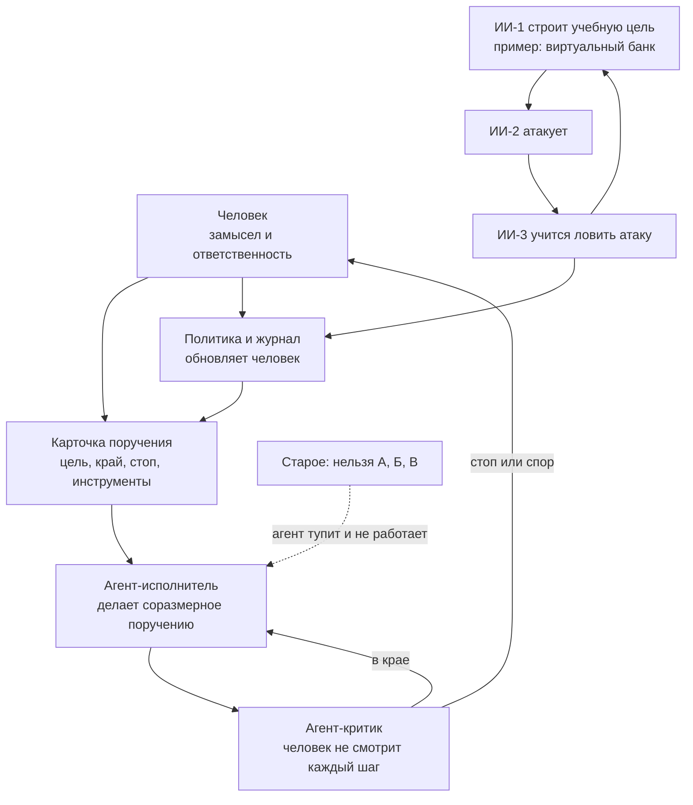

# Схема

Подпись поста и речь 7 октября 2026. Стрелка «гарантия» на схеме намеренно подписана как цель, не как доказанный факт.

Старая природа безопасности: запрет действия.
Новая, по Максимову: верность поручению, машинный контроль, человек отвечает за результат.
Чего на схеме нет и не должно появляться: блока «гарантия».
